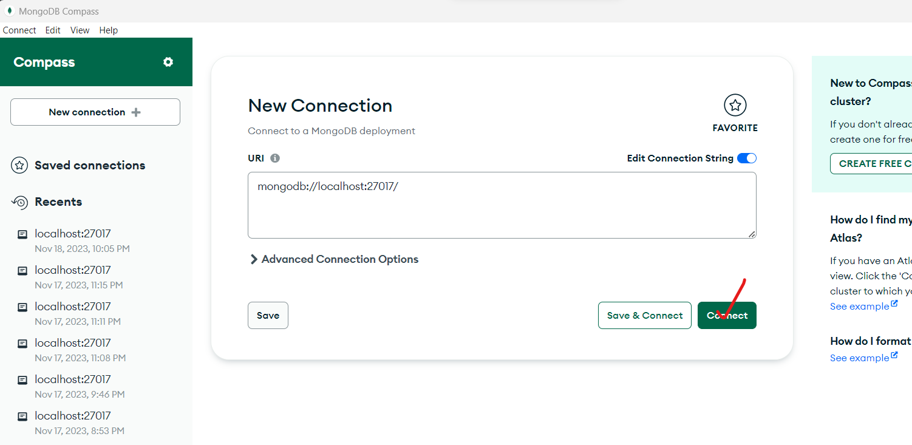
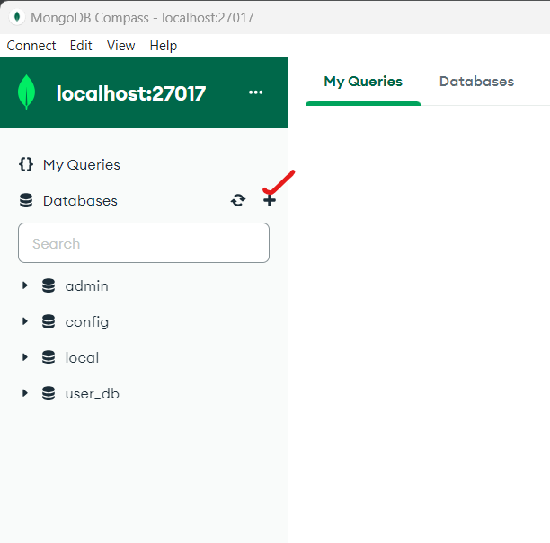
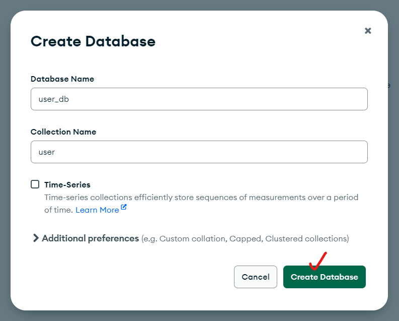
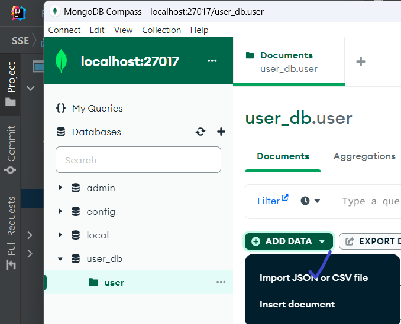

# Departmental Store Management System

- This is Departmental Store Management System project, which is taken as part of SSE-Survey.
- This project runs using the Backend Framework -> Spring Boot framework, Template Engine -> Thymeleaf, Database -> Mongo DB, Security -> Spring Boot Security.

### Build and running the project

- Install Mongo DB community server and Mongo DB compass
- Install Java 1.8
- Install Intellij IDEA IDE
- Open Mongo DB compass and click on connect as shown below

- Click on create Data base

Create Data Base
 

- Click on import Json (Select the file that is in "pre_docs" folder)

- Clone the project
- Open the project by clicking on the "build.gradle" file
- Once after the build, click on the Run Configuration which is automatically created by Intellij IDEA.Run Configuration name - DsmsApplication

### Accessible URL's

- The application will run on the port 7075
- Login page - http://127.0.0.1:7075/login (admin1@gmail.com / admin) (user3@gmail.com / user)
- Registration Page - http://127.0.0.1:7075/register (Register user by giving username and password)